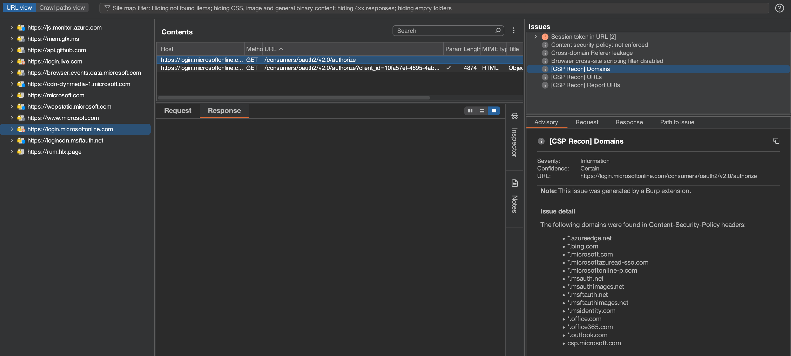

## About
CSP Recon is a Burp Suite extension that passively scans Content-Security-Policy (CSP) headers in HTTP responses. It extracts domains, URLs, and report URIs from CSP headers and presents them in Burp Suite Issues tab.

### Features

- Extracts and deduplicates CSP policies
- Detects different CSP policies implemented in the same application
- Identifies domains, URLs, and report URIs
- Automatically reports findings as informational issues

### Installation
1. Download the `csprecon-burp.py`
2. Go to the **Extensions** -> **Installed** and click **Add** under **Burp Extensions**.
3. Select **Extension type** of **Python** and select the **csprecon-burp.py** file.

### Usage

1. Load the extension in Burp Suite.
2. As HTTP traffic flows through Burp, the extension will analyze CSP headers.
3. Findings will appear as informational issues.

### Requirements

- Burp Suite Professional
- Jython installed and configured in Burp Suite

### Author
@haxxm0nkey

Good luck and good hunting!

